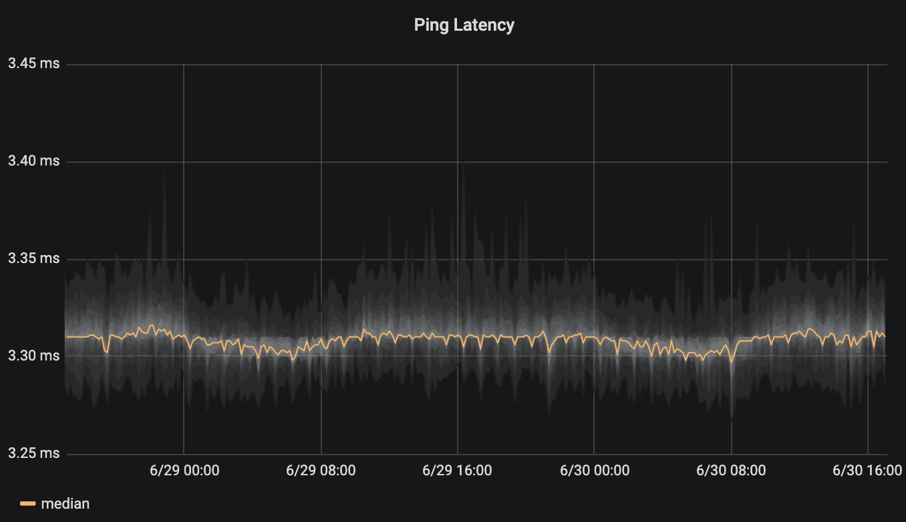

# fping-exporter

fping-exporter allows you to run measure network latency using fping and
prometheus. Compared to blackbox-exporter, it gives you additionally latency
distribution and a packet loss statistics. Also, it is probably better
performing thanks to fping.

**WARNING: This is currently a work in progress, the code is not production-ready yet**

This graph shows the fping\_rtt summary as "SmokePing"-like graph in Grafana:


## Usage

1. Start fping-exporter as follows:
   ```
     fping-exporter [OPTIONS]
   
   Application Options:
     -l, --listen=[HOST]:PORT    Listen address (default: :9605)
     -p, --period=SECS           Period in seconds, should match Prometheus scrape interval (default: 60)
     -f, --fping=PATH            Fping binary path (default: /usr/bin/fping)
     -c, --count=N               Number of pings to send at each period (default: 20)
   
   Help Options:
     -h, --help                  Show this help message
   ```
2. Configure Prometheus to use this, as you would with blackbox-exporter. For example:
   ```
   global:
     scrape_interval: 60s
   
   scrape_configs:
     - job_name: test
       metrics_path: /probe
       static_configs:
       - targets:
         - "8.8.4.4"
         - "8.8.8.8"
       relabel_configs:
       - source_labels: [__address__]
         target_label: __param_target
       - source_labels: [__param_target]
         target_label: instance
       - target_label: __address__
         replacement: 127.0.0.1:9605  # The fping-exporter's real hostname:port.
   ```

## Metrics

fping-exporter produces the following metrics:

- `fping_sent_count`: Number of sent probes
- `fping_lost_count`: Number of lost probes
- `fping_rtt_count`: Number of measured latencies (successful probes)
- `fping_rtt_sum`: Sum of measured latencies
- `fping_rtt`: Summary of measured latencies
