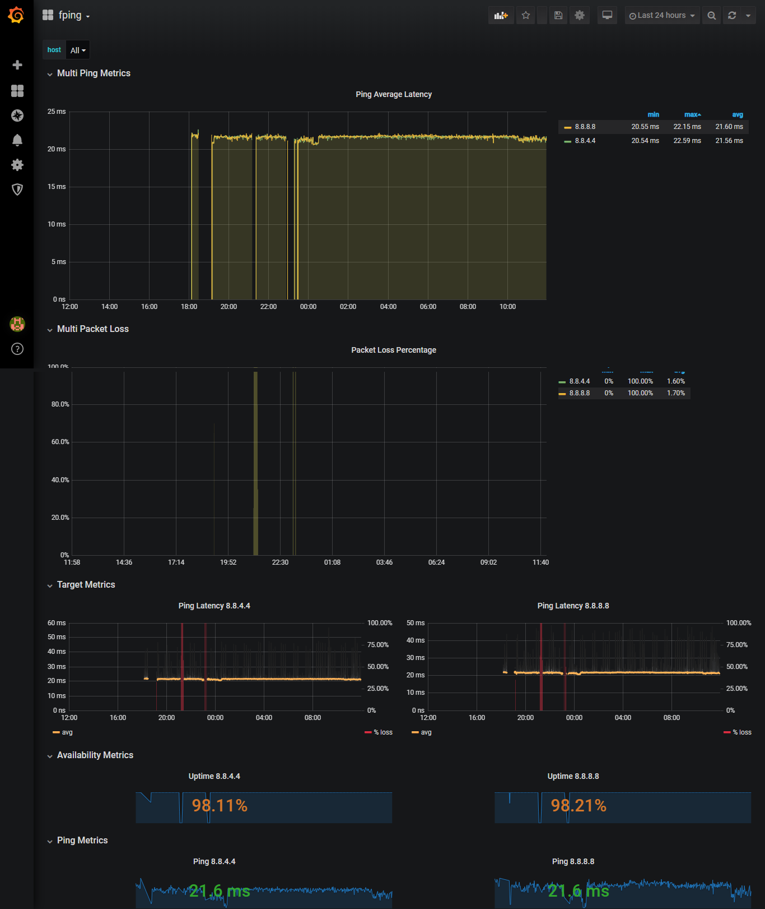

# fping-exporter

fping-exporter allows you to run measure network latency using fping and
prometheus. Compared to blackbox-exporter, it gives you additionally latency
distribution and a packet loss statistics. Also, it is probably better
performing thanks to fping.

**WARNING: This is currently a work in progress, the code is not production-ready yet**

This graph shows the fping\_rtt summary as "SmokePing"-like graph in Grafana:


## Usage

1. Start fping-exporter as follows:
   ```
     fping-exporter [OPTIONS]
   
   Application Options:
     -l, --listen=[HOST]:PORT    Listen address (default: :9605)
     -p, --period=SECS           Period in seconds, should match Prometheus scrape interval (default: 60)
     -f, --fping=PATH            Fping binary path (default: /usr/bin/fping)
     -c, --count=N               Number of pings to send at each period (default: 20)
   
   Help Options:
     -h, --help                  Show this help message
   ```
2. Configure Prometheus to use this, as you would with blackbox-exporter. For example:
   ```
   global:
     scrape_interval: 60s
   
   scrape_configs:
     - job_name: test
       metrics_path: /probe
       static_configs:
       - targets:
         - "8.8.4.4"
         - "8.8.8.8"
       relabel_configs:
       - source_labels: [__address__]
         target_label: __param_target
       - source_labels: [__param_target]
         target_label: instance
       - target_label: __address__
         replacement: 127.0.0.1:9605  # The fping-exporter's real hostname:port.
   ```

## Installation for CentOS 8
1. Install Go on RHEL 8 using and set PATH :
```
[root@prometheus ~]# sudo yum module -y install go-toolset
[root@prometheus ~]# vi ~/.bash_profile
[root@prometheus ~]# export PATH=$PATH:/usr/bin/go
[root@prometheus ~]# source ~/.bash_profile
```
2. Install fping on RHEL 8 using :
```
[root@prometheus ~]# yum install -y fping
```
3. Download and compile fping-exporter on RHEL 8 using :
```
[root@prometheus ~]# git clone https://github.com/schweikert/fping-exporter.git /tmp/fping-exporter
[root@prometheus ~]# go build -o /tmp/fping-exporter
[root@prometheus ~]# cp fping-exporter /usr/local/bin
```
4. Next, adjust the firewall as follows to allow external connections to the server via port 9605
```
[root@prometheus ~]# firewall-cmd --add-port=9605/tcp --permanent
[root@prometheus ~]# firewall-cmd --reload
```
5. Creating a Systemd service file for fping-exporter (For us to manage fping-exporter as a service using systemd, we need to create a system file for it. So, create the file as shown and paste the content,)
```
[root@prometheus ~]# vi /etc/systemd/system/fping-exporter.service
```

```
[Unit]
Description=fping-exporter allows you to run measure network latency using fping and prometheus
Wants=network-online.target
After=network-online.target

[Service]
User=root
Group=root
Type=simple
CapabilityBoundingSet=CAP_NET_RAW
AmbientCapabilities=CAP_NET_RAW

# Application Options:
#   -l, --listen=[HOST]:PORT    Listen address (default: :9605)
#   -p, --period=SECS           Period in seconds, should match Prometheus scrape interval (default: 60)
#   -f, --fping=PATH            Fping binary path (default: /usr/bin/fping)
#   -c, --count=N               Number of pings to send at each period (default: 20)

ExecStart=/usr/local/bin/fping-exporter \
    -f /usr/sbin/fping \
    -p 300 \
    -c 5

[Install]
WantedBy=multi-user.target
```
6. For the changes to take effect, reload the systemctl :
```
[root@prometheus ~]# systemctl daemon-reload
```
7. Now start and enable fping-exporter to run on boot
```
[root@prometheus ~]# systemctl start fping-exporter
[root@prometheus ~]# systemctl enable fping-exporter
```
8. Just to be certain that fping-exporter is running, run the command:
```
[root@prometheus ~]# systemctl status fping-exporter
```
   
## Metrics

fping-exporter produces the following metrics:

- `fping_sent_count`: Number of sent probes
- `fping_lost_count`: Number of lost probes
- `fping_rtt_count`: Number of measured latencies (successful probes)
- `fping_rtt_sum`: Sum of measured latencies
- `fping_rtt`: Summary of measured latencies
